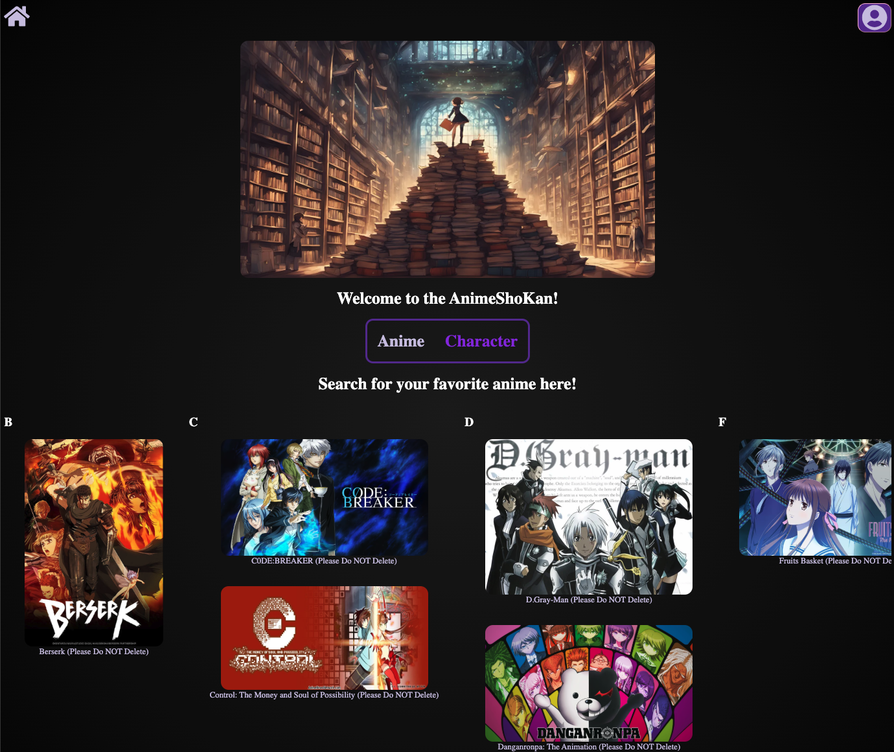

# AnimeShoKan
By [Daniel Ho](https://github.com/dwho0937wei-dotcom)

## Technologies Used
1. Backend
    1. Python
    2. Flask
    3. SQLAlchemy
    4. WTForm
2. Frontend
    1. JavaScript
    2. React/Redux

## Overview
AnimeShoKan is a catolog library website that lists various existing anime and characters of these existing anime. 
Each anime will also have their corresponding characters and episodes.

When first entering the website, you will be where they list all the anime in alphabetical catalogs.

The alphabetical catalogs are listed horizontally where