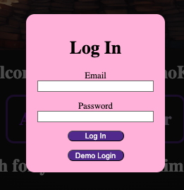

# AnimeShoKan
By [Daniel Ho](https://github.com/dwho0937wei-dotcom)

## Technologies Used
1. Backend
    1. Python
    2. Flask
    3. SQLAlchemy
    4. WTForm
2. Frontend
    1. JavaScript
    2. React/Redux

## Overview
AnimeShoKan is a catolog library website that lists various existing anime and characters of these existing anime. 
Each anime will also have their corresponding characters and episodes.

When first entering the website, you will be where they list all the anime in alphabetical catalogs.

The alphabetical catalogs are listed horizontally and each catalog itself lists the anime vertically.

Whenever you click an anime, you will be directed to the anime page where you can see the list of characters and episodes associated it.

You can also go the character catalog library to see the list of characters.

Each character has their own page explaining about what they are like in the anime.

You will find the profile button on the top right corner where you can login or sign up a new account.

It'll open up a modal for you to do it.

Once logged in, you will now have the option to create a new anime or a new character to share.

Here are the forms for creating a new anime or a new character.

Note when creating a new character, you can only add them to the existing anime that YOU yourself have created.

When you enter into the anime page you've created, you can update the anime page, delete the anime, add a new episode, or as mentioned before, add a new character in it.

This will be the update anime form.

This is where you can create and add new episodes for your created anime!

When you click on the episodes in the anime page, you will enter the episode page where it will show the title, plot, aired date, and the image of that episode. 

If there exists a previous episode, the "prev" button will appear to go there and same can be said for next episode for "next" button.

If you are currently on the episode that you've created, then you can obviously update or delete the episode.

Here's what an episode update form look like.

In the page of the character you've created, you can update and delete the character.

Here's the update character form!

Finally, as a user, you have your own profile page where you can see all the anime and characters that you have created!

You can even visit other user's profile page as well!

